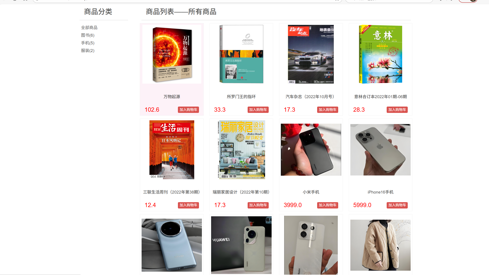
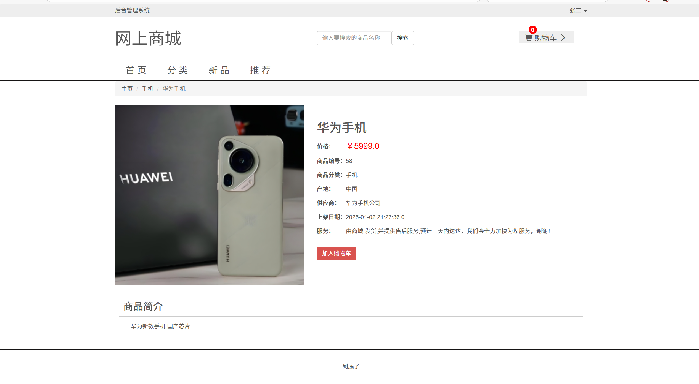
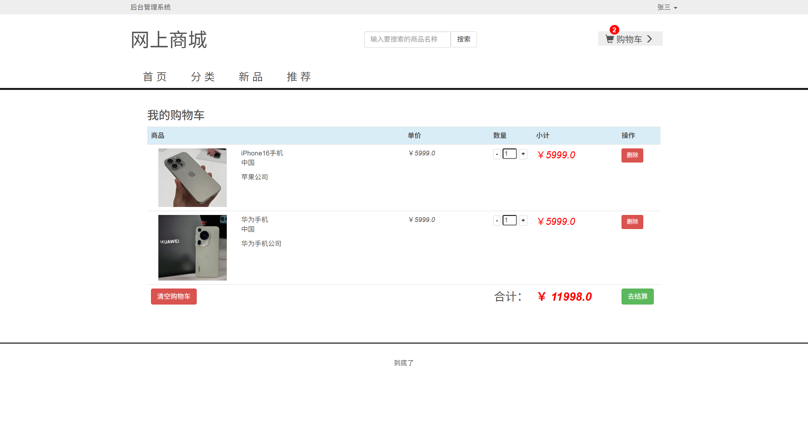
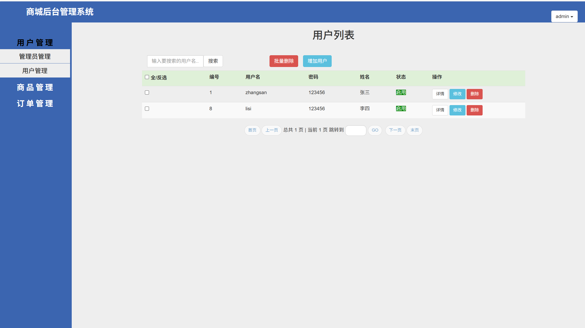
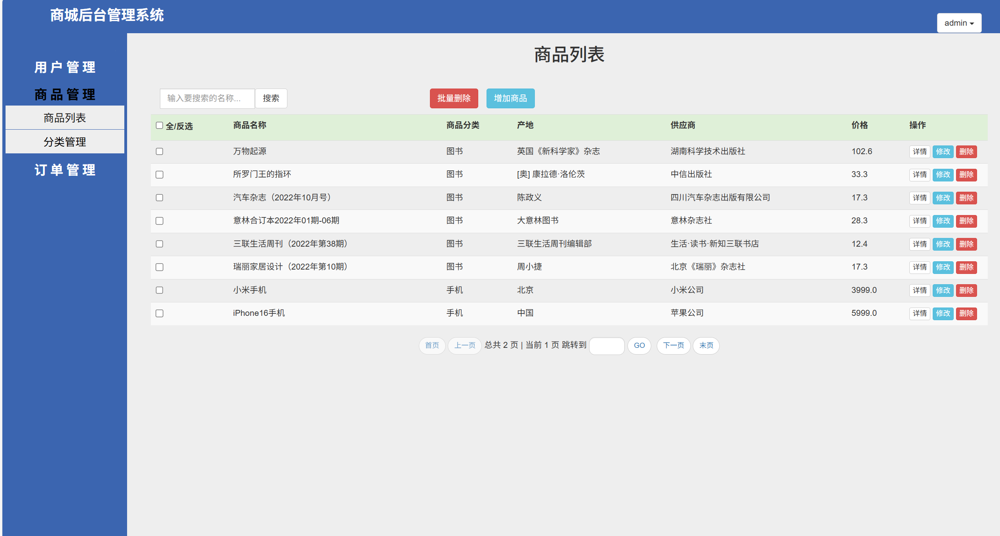
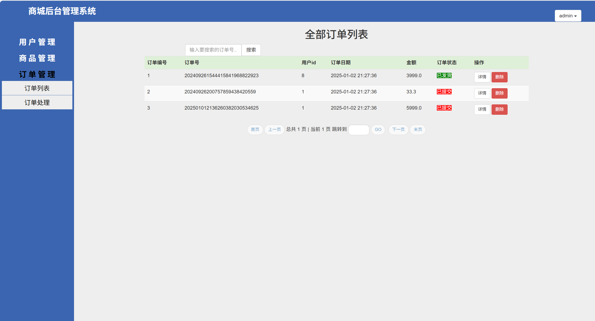
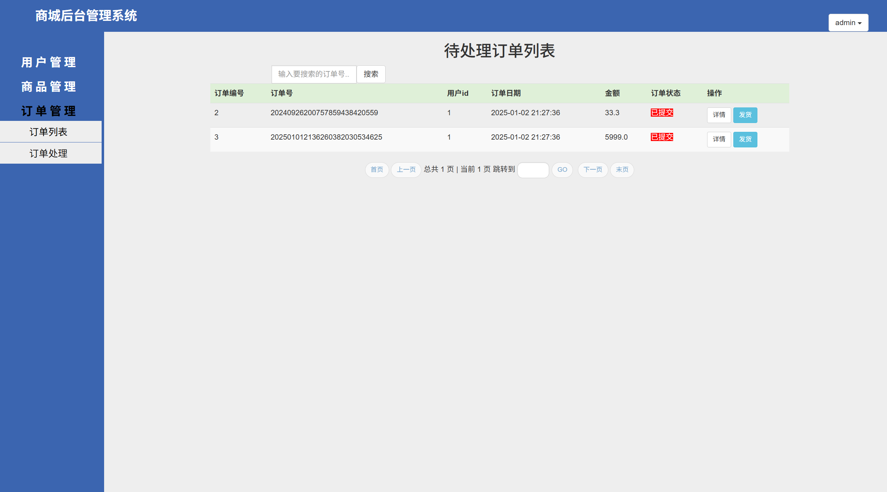

# jspServlet005
jspServlet005购物商城电商系统
 
## 查看主页获取源码

### 一、关键词
购物商城系统，购物商城电商系统

### 二、作品包含
源码+数据库+设计报告文档+运行视频+全套环境和工具资源+本地部署教程

### 三、项目技术
前端技术：Html、Css、Js、Jquery、Bootstrap
后端技术：Java、JSP、Servlet、JDBC

### 四、运行环境（以下版本亲测，其他版本兼容性请自行测试）
开发工具：IDEA/eclipse

数据库：MySQL5.7或8.0

服务器：Tomcat8.5或Tomcat9.0

数据库管理工具：Navicat10以上版本

环境配置软件： JDK1.8

浏览器：谷歌浏览器

### 五、项目介绍
项目编号：jspServlet005

电子商务(Electronic Commerce)是互联网上出现的新概念。它是利用计算机技术、网络技术和远程通信技术，实现整个商务(买卖)过程中的电子化、数字化和网络化。随着它的广泛使用,给人们带来了便利，并逐渐改变了人们的生活方式. 

国内在线购物网站多数是用ASP，PHP技术实现的，而基于JSP的优秀网站较少。本系统——网上商城系统采用JSP+JavaBean+ MySQL数据库三层模式设计并实现。本论文详细地阐述了系统的需求分析、系统总体架构、详细设计以及模块的实现过程，主要实现了以下模块功能：会员注册、登录/注销；用户管理；浏览商品详细信息；商品搜索；商品管理；购物车；订单；订单管理等

网上商品超市系统，前台支持商品展示（分类 / 新品 / 推荐等）、购物车（添加 / 查看 / 结算等）、收银台（提交订单）、会员管理（注册 / 登录 / 资料修改）及订单查询；后台可进行商品管理（查看 / 添加 / 修改 / 删除）、用户管理（查看 / 修改信息）、订单管理（查看 / 操作订单），实现购物全流程管控 。

### 六、运行截图

